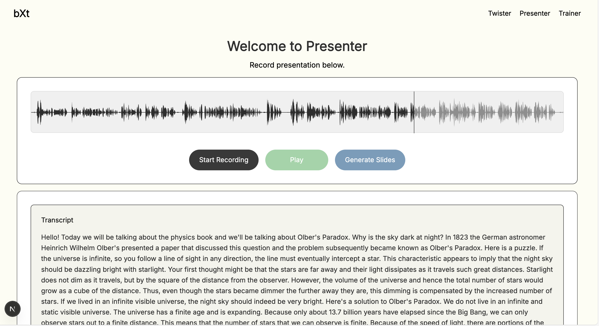
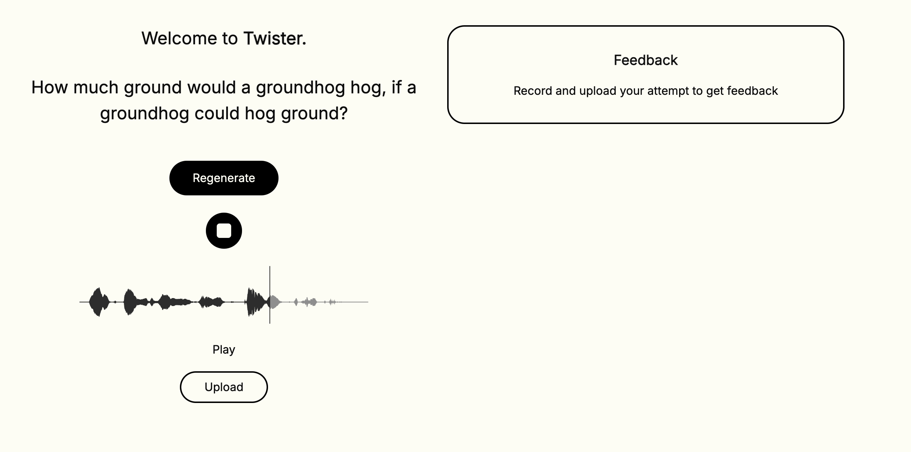

Deployed on Vercel: 

Meet baXter, your personal speech training agent. Go to Twister to read tongue-twsiters and get personalized feedback on pitch and pause done using librosa. Go to Presenter mode to practice your speech and generate a presentation using Whisper API for transcription and other OpenAI models. 

Here are some screenshots, all audio recordings are stored in Supabase Bucket. 

There are many things that can be improved, but this is a start.
